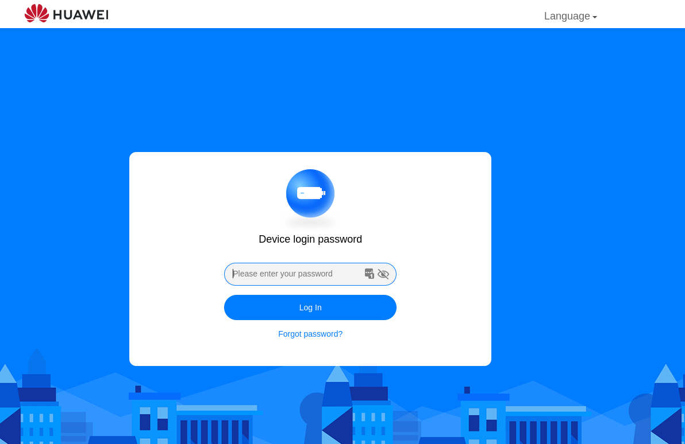
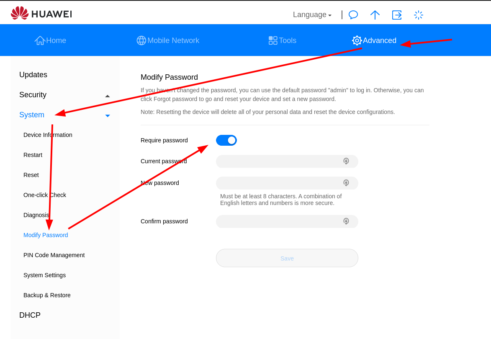
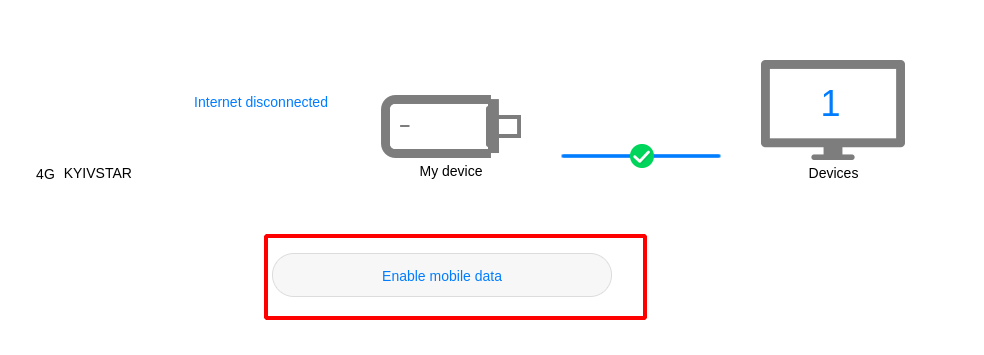
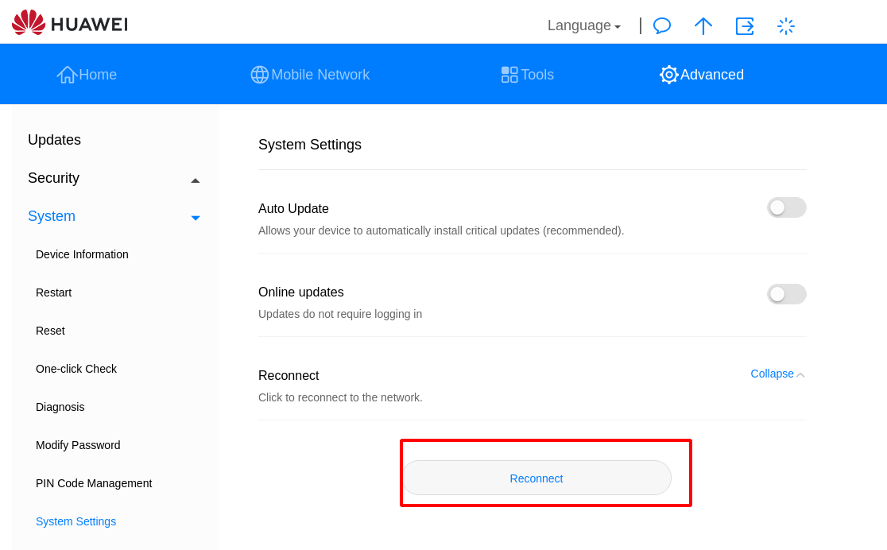

# huawei-hilink client
 Control Huawei hilink router (CL4E3372HM) from the bash console

[](https://github.com/vzakharchenko/E3372h-320-cli/actions/workflows/main.yml)


# Features
- [can encrypt/decrypt huawei hilink-api](#encryptdecrypt-hilink-api)
- [support "device login password"](#device-login-password-page)
- can [read](#list-sms-for-the-specific-phone) and [send](#send-sms) SMS messages from the command line
- [reconnect network](#mobiledata)
- [on/off mobile data](#mobiledata)
- [get supported LTE Band and mobile connection status](#get-current-lte-band-and-mobile-connection-status-until-interrupted)
- [change/set LTE Band(s)](#set-lte-band-to-b3b7b8)

# Tested on
E3372h-320
version: 11.0.1.1(H697SP1C983)
Web UI version WEBUI 11.0.1.1(W13SP2C7201)


## Requirement
 - nodejs (>12)
## Installation
- install package
```
sudo npm i huawei-hilink -g
```

## Docker installation
TODO

## Device Login password Page

add argument **--password="YOUR_PASSWORD"** to command line.




- example
```
huawei-hilink sendSMS  --phone=+11111111111 --message="Test message" --password="YOUR_PASSWORD"
```

## How to use

### Help

```
huawei-hilink --help
```
result:
```
huawei-hilink [command]

Commands:
  huawei-hilink sendSMS        send SMS to contact or group of contacts
  huawei-hilink contacts       get contact list with the latest sms messages
  huawei-hilink messages       get all messages from InBox
  huawei-hilink contactPages   contact list pages
  huawei-hilink sms            get contact SMS list
  huawei-hilink pages          count of sms pages
  huawei-hilink deleteSMS      delete sms by smsId
  huawei-hilink mobileData     Enable/Disable or Reconnect Mobile Data
  huawei-hilink monitoring     current Monitoring status
  huawei-hilink signalInfo     current device signal status
  huawei-hilink changeLteBand  change LTE band

Options:
  --help           Show help                                           [boolean]
  --version        Show version number                                 [boolean]
  --rsapadingtype  rsapadingtype, to check your run in web-console:
                   MUI.LoginStateController.rsapadingtype[string] [default: "1"]

```
### Version

```
huawei-hilink --version
```
result:
```
1.0.0
```

### Send SMS

- Send message "Test message" to +11111111111
```
huawei-hilink sendSMS  --phone=+11111111111 --message="Test message"
```
- Send message "Test message" to +11111111111 with enabled "Require Password"
```
huawei-hilink sendSMS  --phone=+11111111111 --message="Test message" --password="YOUR_PASSWORD"
```


### SMS Conversation API


 -  get all contacts
```
huawei-hilink contacts
```
Result:
```
MessageId: 40004 Phone: +22222222222 lastMessage: {}
MessageId: 40005 Phone: +11111111111 lastMessage: "Test message"
```
 -  get all contacts with enabled "Require Password"
```
huawei-hilink contacts with enabled "Require Password" --password="YOUR_PASSWORD"
```
Result:
```
MessageId: 40004 Phone: +22222222222 lastMessage: {}
MessageId: 40005 Phone: +11111111111 lastMessage: "Test message"
```
-  get all contacts and export as xml
```
huawei-hilink contacts --exportFormat=xml --exportFile='./contacts.xml'
cat ./contacts.xml
```
Result:
```xml
<response>
<count>2</count>
<messages>

                <message>
                        <smstat>0</smstat>
                        <index>40004</index>
                        <phone>+222222222222</phone>
                        <content></content>
                        <date>2021-10-28 22:27:09</date>
                        <sca></sca>
                        <savetype>0</savetype>
                        <priority>0</priority>
                        <smstype>7</smstype>
                        <unreadcount>0</unreadcount>
                </message>
                <message>
                        <smstat>2</smstat>
                        <index>40005</index>
                        <phone>+11111111111</phone>
                        <content>Test message</content>
                        <date>2021-10-28 21:36:20</date>
                        <sca></sca>
                        <savetype>3</savetype>
                        <priority>4</priority>
                        <smstype>1</smstype>
                        <unreadcount>0</unreadcount>
                </message>
        </messages>
</response>
```

- Example get all contacts and export as json
```
huawei-hilink contacts --exportFormat=json --exportFile='./contacts.json'
cat ./contacts.json
```
Result:
```json
{
   "response":{
      "count":"2",
      "messages":{
         "message":[
            {
               "smstat":"0",
               "index":"40004",
               "phone":"+222222222222",
               "content":{

               },
               "date":"2021-10-28 22:27:09",
               "sca":{

               },
               "savetype":"0",
               "priority":"0",
               "smstype":"7",
               "unreadcount":"0"
            },
            {
               "smstat":"2",
               "index":"40005",
               "phone":"+11111111111",
               "content":"Test message",
               "date":"2021-10-28 21:36:20",
               "sca":{

               },
               "savetype":"3",
               "priority":"4",
               "smstype":"1",
               "unreadcount":"0"
            }
         ]
      }
   }
}
```

### List SMS For the specific phone


- get conversation for phone +111111111111
```
huawei-hilink sms --phone=+111111111111
```
Result:
```
MessageId: 40001 Phone: +111111111111 Message: "test123"
MessageId: 40003 Phone: +111111111111 Message: "test123"
MessageId: 40000 Phone: +111111111111 Message: "Sms"
MessageId: 40002 Phone: +111111111111 Message: {}
MessageId: 40004 Phone: +111111111111 Message: {}

```


- get conversation for phone +111111111111  with enabled "Require Password"
```
huawei-hilink sms --phone=+111111111111 --password="YOUR_PASSWORD"
```
Result:
```
MessageId: 40001 Phone: +111111111111 Message: "test123"
MessageId: 40003 Phone: +111111111111 Message: "test123"
MessageId: 40000 Phone: +111111111111 Message: "Sms"
MessageId: 40002 Phone: +111111111111 Message: {}
MessageId: 40004 Phone: +111111111111 Message: {}

```

- Example get conversation for phone +111111111111 export result as xml
```
huawei-hilink sms  --exportFile=111111111111.xml --exportFormat=xml
cat ./111111111111.xml
```
Result:
```xml
<response>
<count>5</count>
<messages>
<message>
<smstat>3</smstat>
<index>40001</index>
<phone>+111111111111</phone>
<content>test123</content>
<date>2021-10-28 21:26:02</date>
<sca></sca>
<curbox>1</curbox>
<savetype>3</savetype>
<priority>4</priority>
<smstype>1</smstype>
</message>
<message>
<smstat>3</smstat>
<index>40003</index>
<phone>+111111111111</phone>
<content>test123</content>
<date>2021-10-28 21:27:06</date>
<sca></sca>
<curbox>1</curbox>
<savetype>3</savetype>
<priority>4</priority>
<smstype>1</smstype>
</message>
<message>
<smstat>1</smstat>
<index>40000</index>
<phone>+111111111111</phone>
<content>Sms</content>
<date>2021-10-28 21:58:39</date>
<sca></sca>
<curbox>0</curbox>
<savetype>0</savetype>
<priority>0</priority>
<smstype>1</smstype>
</message>
<message>
<smstat>1</smstat>
<index>40002</index>
<phone>+111111111111</phone>
<content></content>
<date>2021-10-28 22:26:05</date>
<sca></sca>
<curbox>0</curbox>
<savetype>0</savetype>
<priority>0</priority>
<smstype>7</smstype>
</message>
<message>
<smstat>1</smstat>
<index>40004</index>
<phone>+111111111111</phone>
<content></content>
<date>2021-10-28 22:27:09</date>
<sca></sca>
<curbox>0</curbox>
<savetype>0</savetype>
<priority>0</priority>
<smstype>7</smstype>
</message>
</messages>
</response>

```

- Example get all contacts and export as json
```
huawei-hilink sms  --exportFile=111111111111.json --exportFormat=json
cat ./111111111111.json
```
Result:
```json
{"response":{"count":"5","messages":{"message":[{"smstat":"3","index":"40001","phone":"+111111111111","content":"test123","date":"2021-10-28 21:26:02","sca":{},"curbox":"1","savetype":"3","priority":"4","smstype":"1"},{"smstat":"3","index":"40003","phone":"+111111111111","content":"test123","date":"2021-10-28 21:27:06","sca":{},"curbox":"1","savetype":"3","priority":"4","smstype":"1"},{"smstat":"1","index":"40000","phone":"+111111111111","content":"Sms","date":"2021-10-28 21:58:39","sca":{},"curbox":"0","savetype":"0","priority":"0","smstype":"1"},{"smstat":"1","index":"40002","phone":"+111111111111","content":{},"date":"2021-10-28 22:26:05","sca":{},"curbox":"0","savetype":"0","priority":"0","smstype":"7"},{"smstat":"1","index":"40004","phone":"+111111111111","content":{},"date":"2021-10-28 22:27:09","sca":{},"curbox":"0","savetype":"0","priority":"0","smstype":"7"}]}}}
```

### Delete sms message


-  delete message
```
huawei-hilink deleteSMS  --messageId=40005
```

-  delete message   with enabled "Require Password"
```
huawei-hilink deleteSMS  --messageId=40005 --password="YOUR_PASSWORD"
```

### mobileData

-  disable mobile data

```
huawei-hilink mobileData --mode=off --password="YOUR_PASSWORD"
```

- Example enable mobile data

```
huawei-hilink mobileData --mode=on --password="YOUR_PASSWORD"
```
- Example reconnect

```
huawei-hilink mobileData --mode=reconnect  --password="YOUR_PASSWORD"
```

###  current Monitoring status

- get current status
```
huawei-hilink monitoring
```
```
ConnectionStatus=901
WifiConnectionStatus=[object Object]
SignalStrength=[object Object]
SignalIcon=4
CurrentNetworkType=19
CurrentServiceDomain=3
RoamingStatus=0
BatteryStatus=[object Object]
BatteryLevel=[object Object]
BatteryPercent=[object Object]
simlockStatus=0
PrimaryDns=195.38.164.15
SecondaryDns=195.38.164.16
wififrequence=0
flymode=0
PrimaryIPv6Dns=[object Object]
SecondaryIPv6Dns=[object Object]
CurrentWifiUser=[object Object]
TotalWifiUser=[object Object]
currenttotalwifiuser=0
ServiceStatus=2
SimStatus=1
WifiStatus=[object Object]
CurrentNetworkTypeEx=101
maxsignal=5
wifiindooronly=0
classify=hilink
usbup=0
wifiswitchstatus=0
WifiStatusExCustom=0
hvdcp_online=0
speedLimitStatus=0
poorSignalStatus=0
```

-  get status export result as xml
```
huawei-hilink monitoring  --exportFile=status.xml --exportFormat=xml
cat ./status.xml
```
Result:
```xml
<?xml version="1.0" encoding="UTF-8"?>
<response>
<ConnectionStatus>901</ConnectionStatus>
<WifiConnectionStatus></WifiConnectionStatus>
<SignalStrength></SignalStrength>
<SignalIcon>3</SignalIcon>
<CurrentNetworkType>19</CurrentNetworkType>
<CurrentServiceDomain>3</CurrentServiceDomain>
<RoamingStatus>0</RoamingStatus>
<BatteryStatus></BatteryStatus>
<BatteryLevel></BatteryLevel>
<BatteryPercent></BatteryPercent>
<simlockStatus>0</simlockStatus>
<PrimaryDns>195.38.164.15</PrimaryDns>
<SecondaryDns>195.38.164.16</SecondaryDns>
<wififrequence>0</wififrequence>
<flymode>0</flymode>
<PrimaryIPv6Dns></PrimaryIPv6Dns>
<SecondaryIPv6Dns></SecondaryIPv6Dns>
<CurrentWifiUser></CurrentWifiUser>
<TotalWifiUser></TotalWifiUser>
<currenttotalwifiuser>0</currenttotalwifiuser>
<ServiceStatus>2</ServiceStatus>
<SimStatus>1</SimStatus>
<WifiStatus></WifiStatus>
<CurrentNetworkTypeEx>101</CurrentNetworkTypeEx>
<maxsignal>5</maxsignal>
<wifiindooronly>0</wifiindooronly>
<classify>hilink</classify>
<usbup>0</usbup>
<wifiswitchstatus>0</wifiswitchstatus>
<WifiStatusExCustom>0</WifiStatusExCustom>
<hvdcp_online>0</hvdcp_online>
<speedLimitStatus>0</speedLimitStatus>
<poorSignalStatus>0</poorSignalStatus>
</response>
```

- get current status export result as json
```
huawei-hilink monitoring  --exportFile=status.json --exportFormat=json
cat ./status.json
```
Result:
```json
{"response":{"ConnectionStatus":"901","WifiConnectionStatus":{},"SignalStrength":{},"SignalIcon":"3","CurrentNetworkType":"19","CurrentServiceDomain":"3","RoamingStatus":"0","BatteryStatus":{},"BatteryLevel":{},"BatteryPercent":{},"simlockStatus":"0","PrimaryDns":"195.38.164.15","SecondaryDns":"195.38.164.16","wififrequence":"0","flymode":"0","PrimaryIPv6Dns":{},"SecondaryIPv6Dns":{},"CurrentWifiUser":{},"TotalWifiUser":{},"currenttotalwifiuser":"0","ServiceStatus":"2","SimStatus":"1","WifiStatus":{},"CurrentNetworkTypeEx":"101","maxsignal":"5","wifiindooronly":"0","classify":"hilink","usbup":"0","wifiswitchstatus":"0","WifiStatusExCustom":"0","hvdcp_online":"0","speedLimitStatus":"0","poorSignalStatus":"0"}}
```


# get Current LTE Band and mobile connection status

```
huawei-hilink signalInfo --url=192.168.89.1
```
Result
```
LTE Band: B1+B3+B7+B8+B20+B28 rssi: -81dBm rsrp: -114dBm rsrq: -15.0dB sinr: -7dB dlbandwidth: 15MHz ulbandwidth: 15MHz band: 7 cell_id: 42181419 plmn: 25503
```

# get Current LTE Band and mobile connection status until interrupted

```
huawei-hilink signalInfo -turn=true --url=192.168.89.1
```
```
LTE Band: B1+B3+B7+B8+B20+B28 rssi: -79dBm rsrp: -113dBm rsrq: -15.0dB sinr: -9dB dlbandwidth: 15MHz ulbandwidth: 15MHz band: 7 cell_id: 42181419 plmn: 25503
LTE Band: B1+B3+B7+B8+B20+B28 rssi: -79dBm rsrp: -113dBm rsrq: -15.0dB sinr: -9dB dlbandwidth: 15MHz ulbandwidth: 15MHz band: 7 cell_id: 42181419 plmn: 25503
LTE Band: B1+B3+B7+B8+B20+B28 rssi: -69dBm rsrp: -97dBm rsrq: -9.0dB sinr: 12dB dlbandwidth: 15MHz ulbandwidth: 15MHz band: 7 cell_id: 42181419 plmn: 25503
LTE Band: B1+B3+B7+B8+B20+B28 rssi: -75dBm rsrp: -102dBm rsrq: -9.0dB sinr: 0dB dlbandwidth: 15MHz ulbandwidth: 15MHz band: 7 cell_id: 42181419 plmn: 25503
LTE Band: B1+B3+B7+B8+B20+B28 rssi: -75dBm rsrp: -102dBm rsrq: -9.0dB sinr: 0dB dlbandwidth: 15MHz ulbandwidth: 15MHz band: 7 cell_id: 42181419 plmn: 25503
LTE Band: B1+B3+B7+B8+B20+B28 rssi: -75dBm rsrp: -102dBm rsrq: -9.0dB sinr: 0dB dlbandwidth: 15MHz ulbandwidth: 15MHz band: 7 cell_id: 42181419 plmn: 25503
LTE Band: B1+B3+B7+B8+B20+B28 rssi: -73dBm rsrp: -104dBm rsrq: -12.0dB sinr: -4dB dlbandwidth: 15MHz ulbandwidth: 15MHz band: 7 cell_id: 42181419 plmn: 25503
```

# Change LTE Band to Auto
```
huawei-hilink changeLteBand --url=192.168.89.1 --band=AUTO
```
# Set LTE Band to B3+B7+B8
```
huawei-hilink changeLteBand --url=192.168.89.1 --band="3+7+8"
```
# Set LTE Band to  B1+B3+B7+B8+B20+B28
```
huawei-hilink changeLteBand --url=192.168.89.1 --band="1+3+7+8+20+28"
```
# Set LTE Band to  B7
```
huawei-hilink changeLteBand --url=192.168.89.1 --band=7
```

#  encrypt/decrypt hilink api
## [Login API](https://github.com/vzakharchenko/huawei-hilink/blob/fa3d36e4df622999c674f39342bb196500208d8b/src/startSession.ts#L57):
- http://${MODEM_API}/api/webserver/token
- http://${MODEM_API}/api/user/challenge_login
- http://${MODEM_API}/api/user/authentication_login
## Encrypted/Decrypted API:
- http://${MODEM_API}/api/sms/sms-list-phone
- http://${MODEM_API}/api/sms/sms-list-contact
## Only Encrypted API:
- http://${MODEM_API}/api/sms/sms-count-contact
- http://${MODEM_API}/api/sms/delete-sms
- http://${MODEM_API}/api/sms/send-sms
- http://${MODEM_API}/api/dialup/mobile-dataswitch
- http://${MODEM_API}/api/net/reconnect

example how to encrypt/decrypt API
```
    const scram = huawei.CryptoJS.SCRAM();
    const smsNonce = scram.nonce().toString();
    const smsSalt = scram.nonce().toString();
    const nonceStr = smsNonce + smsSalt;
    const encrpt_nonce = await huawei.doRSAEncrypt(sessionData0, nonceStr);
    const data = await huawei.doRSAEncrypt(sessionData, `<?xml version="1.0" encoding="UTF-8"?><request><phone>${phone}</phone><pageindex>${pageindex}</pageindex><readcount>20</readcount><nonce>${encrpt_nonce}</nonce></request>`);
    const resp = await restCalls.sendDataRaw(`http://${sessionData0.url}/api/sms/sms-list-phone`, 'POST', data, await getSessionHeaders(sessionData.url));
    huawei.publicSession.token2 = resp.headers.__requestverificationtoken;
    const pwdret = await parser.parseStringPromise((resp.data));
    const decodedResponseText = huawei.dataDecrypt(scram, smsNonce, smsSalt, nonceStr, pwdret);
```

example only encrypt API
```
    const scram = huawei.CryptoJS.SCRAM();
    const smsNonce = scram.nonce().toString();
    const smsSalt = scram.nonce().toString();
    const nonceStr = smsNonce + smsSalt;
    const encrpt_nonce = await huawei.doRSAEncrypt(sessionData, nonceStr);
    const data = await huawei.doRSAEncrypt(sessionData, `<?xml version="1.0" encoding="UTF-8"?><request><Index>-1</Index><Phones><Phone>${(phones)}</Phone></Phones><Sca></Sca><Content>${message}</Content><Length>${message.length}</Length><Reserved>1</Reserved><Date>2021-10-27 00:12:24</Date><nonce>${encrpt_nonce}</nonce></request>`);
    const resp = await restCalls.sendDataRaw(`http://${sessionData.url}/api/sms/send-sms`, 'POST', data, await getSessionHeaders(sessionData.url));
    huawei.publicSession.token2 = resp.headers.__requestverificationtoken;
    const responseText = resp.data;
```

# rsapadingtype parameter value

1. open modem web-ui : ```http://192.168.8.1```
2. open web console on your browser (Chrome Ctrl+Shift+I)
3. open tab console
4. execute command
```
EMUI.LoginStateController.rsapadingtype
```


